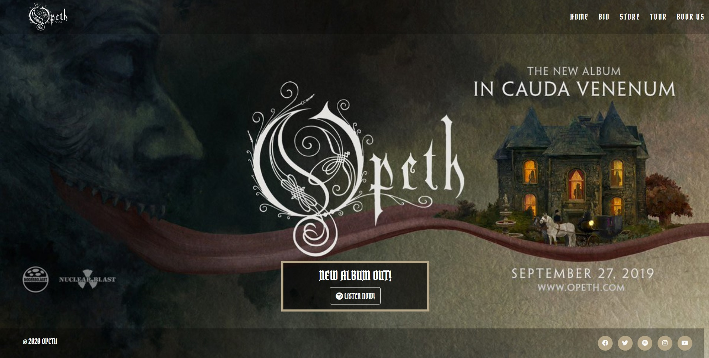
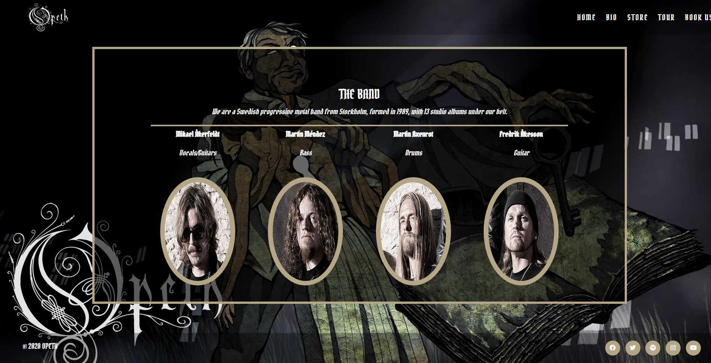
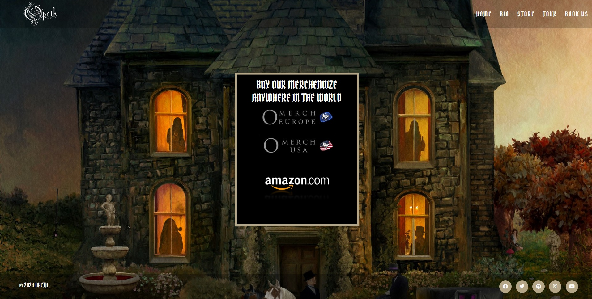
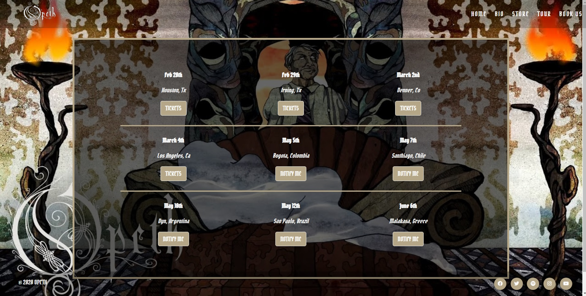
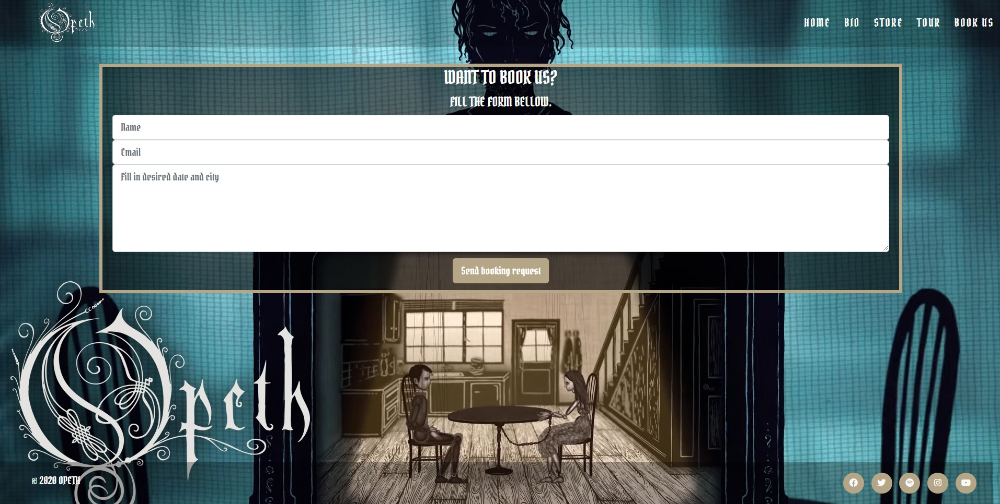

# Opeth band website
Milestone Project #1 : User-Centric Frontend Development - Code Institute 

## Demo
[Live demo](https://nikolaspolychronidis.github.io/user-centric-fronted-development-milestone-project/) is available here.

I have built a website for the best progressive metal band in the world, Opeth. The design is user friendly and easy on the eyes while the website itself contains everything a band and its audience need in order to establish a bond: A home page display a promotional image with the latest album as well as a link to listen to it on Spotify. A bio page to view the band's origins as well as current members, a store page with link to the bands official European, American as well as Amazon store where numerous tshirts, albums and posters are sold. A Tour page with all the upcoming shows as well as direct links to buy tickets. And finally a Book us page for potential business inquiries by promoters and event managers who want to book the band for a show. In the footer of each page are the links to the bands social media where fans can keep in touch with the band.

## UX

The purpose of this project is to create a static **(front-end only)** website for the Swedish progressive metal band Opeth, who recently released their 13th studio album. A band's website is basically a promotional tool for existing as well as new fans to first of all notice the new studio release of the band which is shown in the homepage with a link that leads to spotify. Moreover fans will be able find out more about the band, its music, check out official sources to the band's merchandise, see where the band is playing and get links to the band's verified official social media pages.

**In order for the target audience to achieve these things when visiting my website, I incorporated the following:**
- A big background image in the homepage where the new album is clearly advertised with a link to spotify where one can listen to it.

- Links to social media in the footer leading to youtube (where one can watch the band's clips) as well as instagram, twitter, facebook (where one can keep in touch with the band).
- A Bio page where new fans can check out basic info about the band (where they are from, how many albums they have realesed, who the members are and what instruments they play).

- A store page with links to the official world-wide stores of the band. The band has different external online stores for Europe and America as well as amazon, so no matter whee the fans live they have access to the Opeth's albums and merchandise.

- A tour page where fans can see where and when upcoming shows are taking place.

- A bookings page so users can book the band for various events.

>I did my best to keep the colors as of the website as consistent as possible, in order to ensure a possitive user experience.
 ### Wireframe Mockups
 
 These can be found at the following links below:
- [Landing Page wireframe](https://github.com/NikolasPolychronidis/user-centric-fronted-development-milestone-project/blob/master/assets/images/home-wireframe.jpg)
- [Bio page wireframe](https://github.com/NikolasPolychronidis/user-centric-fronted-development-milestone-project/blob/master/assets/images/bio-wireframe.jpg)
- [Store wireframe](https://github.com/NikolasPolychronidis/user-centric-fronted-development-milestone-project/blob/master/assets/images/store-wireframe.jpg)
- [Tour wireframe](https://github.com/NikolasPolychronidis/user-centric-fronted-development-milestone-project/blob/master/assets/images/tour-wireframe.jpg)
- [Books us page wireframe](https://github.com/NikolasPolychronidis/user-centric-fronted-development-milestone-project/blob/master/assets/images/bookus-wireframe.jpg)
 

## Technologies
1. HTML
2. CSS
3. Bootstrap (v4.4.1)

## Testing
This site was tested across multiple browsers  (Chrome, Safari, FireFox, Opera) and on multiple mobile devices using Google developer tool(iPad, iPad Pro, iPhone X, iPhone 6/7/8 (Plus), iPhone 5/SE, Pixel 2 (XL), Galaxy S5). The siteis compatible and responsive in all of the above.

## Development
- I used Gitpod for a developer tool (IDE) in this project.

